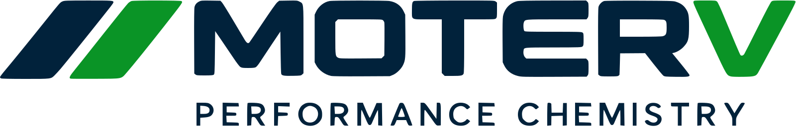
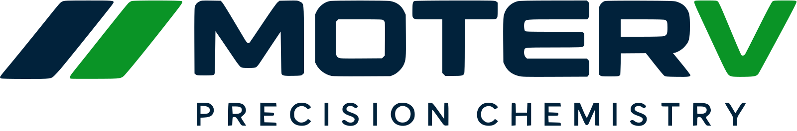

  

<strong>Performance chemistry, connected by software.</strong>

Products · Workshops · Distribution · Teams

---

Moterv develops performance chemistry and the systems that help people select, deliver and support it. We connect product knowledge with the work of workshops, distributors and the teams behind them. Our focus is clear product information, dependable service and tools that respect the boundaries between organisations.

### Our divisions

| Automotive | Robotics |
| :--- | :--- |
|  |  |
| Our first commercial division focuses on automotive products and the workshop and distribution experience around them. | Our research and development direction explores precision chemistry for robotics. |

### Building with care

- **Product clarity.** Make technical information useful to the people choosing and using a product.
- **Connected operations.** Give workshops, distributors and internal teams coherent tools while keeping their roles and data separate.
- **Responsible engineering.** Validate changes locally, preserve provenance and require explicit authority for consequential actions.

Our product and platform monorepo is private during development. This public space introduces Moterv and its divisions; brand assets here are website derivatives of our current identity.
